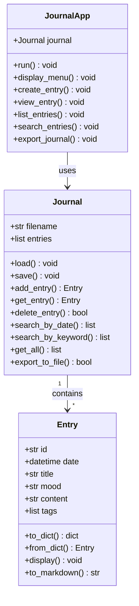
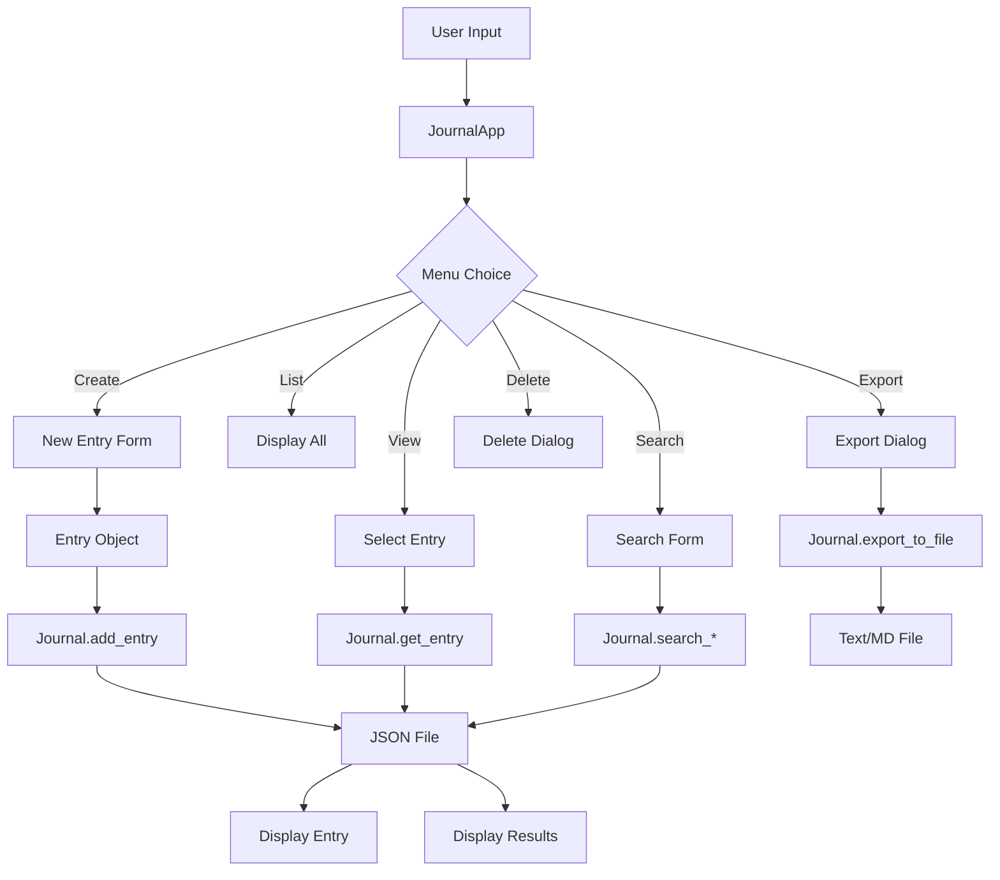

# 📓 Project 06: Personal Journal - Implementation Plan

> **Created:** 2026-02-11  
> **Status:** Planning  
> **Priority:** Medium (Phase 2 continuation)

---

## 📋 Project Overview

A CLI-based personal journal application for daily entries with search and export functionality. This project teaches datetime handling, JSON persistence, text processing, and search algorithms.

### Learning Objectives

- **datetime module** — Date/time handling, formatting, and parsing
- **JSON file I/O** — Persistent storage of journal entries
- **Text processing** — String manipulation and search
- **OOP design** — Entry and Journal classes
- **CLI design** — Menu-driven user interface

---

## 🎯 Features to Implement

### Core Features (Required)

| Feature | Description |
|---------|-------------|
| Create Entry | Add new journal entry with date, title, mood, content |
| View Entry | Display a specific entry by date or ID |
| List Entries | Show all entries with summary info |
| Search | Find entries by date range or keyword |
| Export | Save entries to text or Markdown file |
| Delete Entry | Remove an entry from the journal |

### Extended Features (Optional)

| Feature | Description |
|---------|-------------|
| Daily Prompts | Random writing prompts to inspire entries |
| Mood Tracking | Track and visualize mood over time |
| Tags | Add tags to entries for better organization |
| Statistics | Word count, entries per month, streaks |
| Encryption | Password-protect journal entries |

---

## 📁 File Structure

```
Projects/06_personal_journal/
├── README.md           # Project documentation and guide
├── journal.py          # Main implementation
├── entries.json        # Journal entries storage (created at runtime)
├── prompts.txt         # Writing prompts (optional)
└── challenges.md       # Extension challenges
```

---

## 🏗️ Architecture Design

### Class Diagram



### Data Flow



---

## 📝 Implementation Details

### 1. Entry Class

```python
class Entry:
    """Represents a single journal entry."""
    
    def __init__(self, title, content, mood="neutral", date=None, tags=None):
        self.id = self._generate_id()
        self.date = date or datetime.now()
        self.title = title
        self.mood = mood
        self.content = content
        self.tags = tags or []
    
    def _generate_id(self):
        """Generate unique ID using timestamp."""
        return datetime.now().strftime("%Y%m%d%H%M%S")
    
    def to_dict(self):
        """Convert entry to dictionary for JSON serialization."""
        return {
            "id": self.id,
            "date": self.date.isoformat(),
            "title": self.title,
            "mood": self.mood,
            "content": self.content,
            "tags": self.tags
        }
    
    @classmethod
    def from_dict(cls, data):
        """Create Entry from dictionary."""
        return cls(
            title=data["title"],
            content=data["content"],
            mood=data.get("mood", "neutral"),
            date=datetime.fromisoformat(data["date"]),
            tags=data.get("tags", [])
        )
    
    def display(self):
        """Display entry in formatted output."""
        # Implementation here
        pass
    
    def to_markdown(self):
        """Convert entry to Markdown format."""
        return f"""# {self.title}

**Date:** {self.date.strftime("%Y-%m-%d %H:%M")}  
**Mood:** {self.mood}

{self.content}

**Tags:** {", ".join(self.tags) if self.tags else "none"}
---
"""
```

### 2. Journal Class

```python
class Journal:
    """Manages journal entries and persistence."""
    
    def __init__(self, filename="entries.json"):
        self.filename = filename
        self.entries = []
        self.load()
    
    def load(self):
        """Load entries from JSON file."""
        # Handle FileNotFoundError and JSONDecodeError
        pass
    
    def save(self):
        """Save entries to JSON file."""
        pass
    
    def add_entry(self, title, content, mood="neutral", tags=None):
        """Create and add a new entry."""
        entry = Entry(title, content, mood, tags=tags)
        self.entries.append(entry)
        self.save()
        return entry
    
    def get_entry(self, entry_id):
        """Get entry by ID."""
        for entry in self.entries:
            if entry.id == entry_id:
                return entry
        return None
    
    def delete_entry(self, entry_id):
        """Delete entry by ID."""
        for i, entry in enumerate(self.entries):
            if entry.id == entry_id:
                del self.entries[i]
                self.save()
                return True
        return False
    
    def search_by_date(self, start_date, end_date):
        """Find entries within date range."""
        return [e for e in self.entries 
                if start_date <= e.date <= end_date]
    
    def search_by_keyword(self, keyword):
        """Find entries containing keyword in title or content."""
        keyword = keyword.lower()
        return [e for e in self.entries 
                if keyword in e.title.lower() 
                or keyword in e.content.lower()]
    
    def get_all(self, sort_desc=True):
        """Get all entries, sorted by date."""
        return sorted(self.entries, 
                     key=lambda e: e.date, 
                     reverse=sort_desc)
    
    def export_to_file(self, filename, format="markdown"):
        """Export all entries to a file."""
        # Support both .txt and .md formats
        pass
```

### 3. JournalApp Class (CLI Interface)

```python
class JournalApp:
    """Main application class for CLI interface."""
    
    def __init__(self):
        self.journal = Journal()
        self.prompts = self.load_prompts()
    
    def load_prompts(self):
        """Load writing prompts from file."""
        # Optional feature
        pass
    
    def run(self):
        """Main application loop."""
        self.display_welcome()
        while True:
            self.display_menu()
            choice = self.get_choice()
            # Handle menu choices
            pass
    
    def display_welcome(self):
        """Display welcome message."""
        pass
    
    def display_menu(self):
        """Display main menu options."""
        pass
    
    def create_entry(self):
        """Interactive entry creation."""
        pass
    
    def view_entry(self):
        """View a specific entry."""
        pass
    
    def list_entries(self):
        """List all entries with summaries."""
        pass
    
    def search_entries(self):
        """Search entries by date or keyword."""
        pass
    
    def export_journal(self):
        """Export journal to file."""
        pass
    
    def get_random_prompt(self):
        """Get a random writing prompt."""
        pass
```

---

## 🧪 Testing Scenarios

| Test Case | Description | Expected Result |
|-----------|-------------|-----------------|
| Create Entry | Add new entry with all fields | Entry saved to JSON |
| Create Entry Minimal | Add entry with title/content only | Entry saved with defaults |
| View Entry | View entry by ID | Full entry displayed |
| List Empty | List when no entries | "No entries" message |
| List Multiple | List with several entries | Paginated list |
| Search Date Range | Find entries in date range | Matching entries |
| Search Keyword | Find entries with keyword | Matching entries |
| Search No Results | Search with no matches | "No results" message |
| Export Markdown | Export to .md file | Valid Markdown file |
| Export Text | Export to .txt file | Plain text file |
| Delete Entry | Remove entry by ID | Entry removed |
| Delete Non-existent | Delete invalid ID | Error message |
| Invalid Date | Enter invalid date format | Re-prompt |
| Persistence | Close and reopen app | Entries preserved |

---

## 🎨 UI Design

### Welcome Screen

```
==================================================
        📓 WELCOME TO PERSONAL JOURNAL 📓
==================================================

Your private space for thoughts, ideas, and reflections.

You have 5 entries in your journal.
Last entry: 2026-02-10

==================================================
```

### Main Menu

```
====================
     MAIN MENU
====================
1. ✏️  New Entry
2. 📖 View Entry
3. 📋 List All Entries
4. 🔍 Search Entries
5. 📤 Export Journal
6. 🗑️  Delete Entry
7. 💡 Writing Prompt
8. ❌ Exit
====================
```

### Entry Display

```
==================================================
                    📖 ENTRY
==================================================
ID: 20260210143022
Date: 2026-02-10 14:30
Mood: 😊 Happy

Title: Great Day at the Park
--------------------------------------------------
Today I went to the park and had a wonderful time.
The weather was perfect and I saw some beautiful
flowers blooming...

Tags: nature, outdoor, spring
==================================================
```

---

## 📊 Data Format

### entries.json Structure

```json
{
  "entries": [
    {
      "id": "20260210143022",
      "date": "2026-02-10T14:30:22",
      "title": "Great Day at the Park",
      "mood": "happy",
      "content": "Today I went to the park...",
      "tags": ["nature", "outdoor", "spring"]
    },
    {
      "id": "20260209120000",
      "date": "2026-02-09T12:00:00",
      "title": "Project Ideas",
      "mood": "excited",
      "content": "I have some new project ideas...",
      "tags": ["ideas", "projects"]
    }
  ]
}
```

### prompts.txt Format

```
What made you smile today?
What are you grateful for right now?
Describe a challenge you overcame recently.
What is something new you learned this week?
Write about a person who inspires you.
What would your perfect day look like?
```

---

## 🏆 Challenges (for challenges.md)

1. **Mood Statistics** — Track and display mood distribution over time
2. **Word Count Goals** — Set and track daily/weekly word count goals
3. **Entry Templates** — Create reusable templates for different entry types
4. **Backup System** — Auto-backup entries to a separate file
5. **Import Feature** — Import entries from text files
6. **Encryption** — Add password protection using hashlib
7. **Reminders** — Set daily reminder times (display message when app opens)
8. **Multi-Journal** — Support multiple journals/categories

---

## 📚 Skills Reference

| Skill | Module | Documentation Link |
|-------|--------|-------------------|
| Date/Time | datetime | 01_foundations/06_datetime |
| JSON I/O | json | 10_file_io/03_working_with_json |
| File I/O | os, pathlib | 10_file_io/01_reading_files |
| String Formatting | str | 01_foundations/01_variables_and_types |
| Error Handling | try/except | 08_error_handling |
| OOP | classes | 04_oop_concepts |

---

## ✅ Implementation Checklist

### Files to Create

- [ ] `Projects/06_personal_journal/README.md`
- [ ] `Projects/06_personal_journal/journal.py`
- [ ] `Projects/06_personal_journal/prompts.txt`
- [ ] `Projects/06_personal_journal/challenges.md`

### Implementation Steps

- [ ] Create Entry class with serialization
- [ ] Create Journal class with CRUD operations
- [ ] Implement search functionality
- [ ] Implement export functionality
- [ ] Create JournalApp CLI interface
- [ ] Add writing prompts feature
- [ ] Write comprehensive README
- [ ] Create challenges.md
- [ ] Test all functionality
- [ ] Update PROGRESS_02.md

---

## 🔄 Dependencies

**None** — This project uses only Python standard library:
- `datetime` — Date and time handling
- `json` — JSON serialization
- `os` / `pathlib` — File operations
- `random` — Random prompt selection

---

## 📈 Success Criteria

- [ ] Users can create, view, edit, and delete entries
- [ ] Entries persist between sessions via JSON
- [ ] Search works by date range and keyword
- [ ] Export produces valid Markdown/text files
- [ ] Code follows project style guidelines
- [ ] README provides clear step-by-step guide
- [ ] All code runs without external dependencies

---

**Ready for implementation! 🚀**
